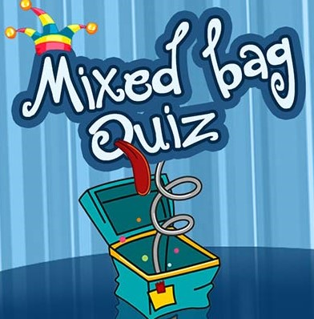

<h1 align="center">Quiz </h1>

 

 Here are some 2-minute quizzes on the following topics
  <ul>
    <li> Maths </li>
    <li> HTML-CSS </li>
    <li> General Knowledge</li>
    </ul>
 

  
 
 The answers and a detailed analysis of your score can be viewed, only after submission. The quiz gets auto-submitted after 2 minutes. 

  Here is the <a href="https://qjz8prombse3ezzfbvidhw-on.drv.tw/www.quiz.com/project_quiz/quiz.html"> link </a> to the quiz.
 <h4 align="center">Thank You!</h4>

